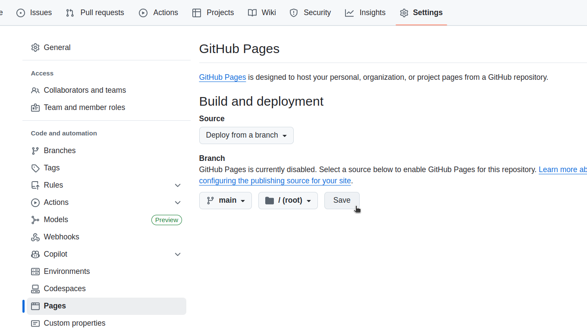
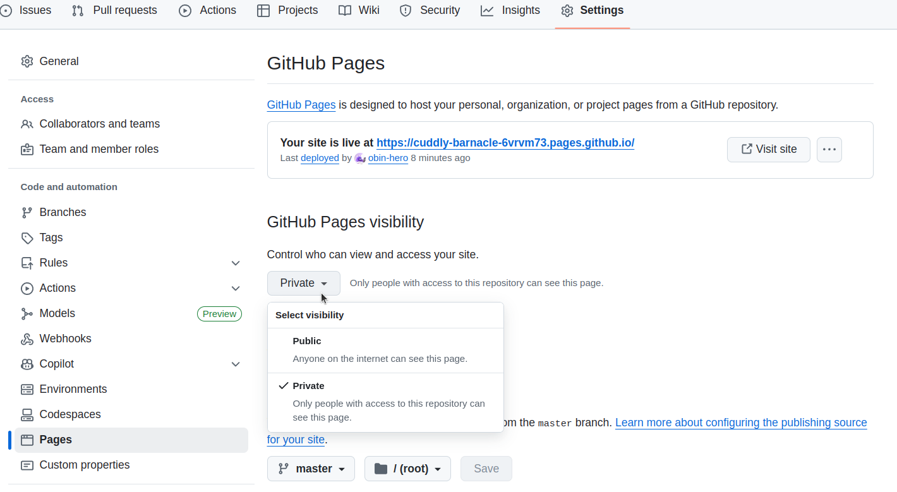

## Project Page Template for KIMLAB
This is a template for creating a project page for KIMLAB. 
Original source code is from [nerfies](https://nerfies.github.io/). 
It's a simple and clean template so actually many people use it.

## How to use
- Clone this repository into your computer.
- Edit `index.html` to add your project information.
- You can change some styles in `style.css`.
- [Deploy Site](#how-to-deploy) : the address will be `https://uiuckimlab.github.io/<your-repo-name>/`

## What to edit
### `index.html`
- [ ] Change the overall description of your project. ([L6-L11](https://github.com/uiuckimlab/project-page-template/blob/master/index.html#L6-L11))
- [ ] Change the project title and author information. ([L91-L108](https://github.com/uiuckimlab/project-page-template/blob/master/index.html#L91-L108))
- [ ] Change the links to your project repository, paper, and other resources. ([L113-L150](https://github.com/uiuckimlab/project-page-template/blob/master/index.html#L113-L150))
- [ ] Freely change or add any sections you want to include in your project page. ([L160-L350](https://github.com/uiuckimlab/project-page-template/blob/master/index.html#L160-L350))
  - You can add more sections by copying and pasting the existing sections.
  - You can also remove any sections you don't need.
- [ ] Change the bibliography section ([L353-L364](https://github.com/uiuckimlab/project-page-template/blob/master/index.html#L353-L364))
- Optional
  - [ ] Add any other works from KIMLAB to navigation bar ([L77](https://github.com/uiuckimlab/project-page-template/blob/master/index.html#L77))
  - [ ] Add your project Logo ([L37](https://github.com/uiuckimlab/project-page-template/blob/master/index.html#L37))
  - [ ] If you want to change the layout of carousel, refer to [here](https://github.com/uiuckimlab/project-page-template/blob/master/static/js/index.js#L32-L39)
## How to test
- [Recommended] If you are using VSCode, just hit Debug for `index.html` and it will open the page in your browser.
- Or, you can test with [jekyll](https://docs.github.com/en/pages/setting-up-a-github-pages-site-with-jekyll/testing-your-github-pages-site-locally-with-jekyll)
  - Install [ruby](https://www.ruby-lang.org/en/documentation/installation/)
    - You might need to run
      ```shell
      sudo apt-get install ruby-dev
      ```
  - Inside the project directory,
    ```shell
    bundle init # This will create a Gemfile
    bundle install 
    bundle add jekyll
    ```
  - Run jekyll server
    ```bash
    bundle exec jekyll serve
    ```
  - Open your browser and go to `http://127.0.0.1:4000/`

## How to deploy 
- Make a new repository in KIMLAB repo, push this project page template to the new repository.
- Go to your new repository on GitHub, `Settings` -> `Pages`
- Select `main` or `master` branch and `/(root)` folder, then click `Save`.

- Wait for a few minutes, then you can access your project page at `https://uiuckimlab.github.io/<your-repo-name>/`
- For example, this repository is published at [https://uiuckimlab.github.io/project-page-template](https://uiuckimlab.github.io/project-page-template)

- You can control the visibility of your project page by changing "Github Pages Visibility" in the same `Settings -> Pages` page.
  
  1. So check your project page locally with VSCode or jekyll server,
  2. Then push it when you are ready, deploy it, it will automatically published as private.
  3. Finally, change the page visibility to public when you are ready to share it with others
